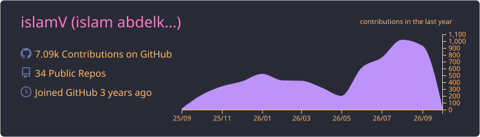
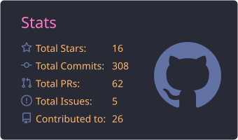
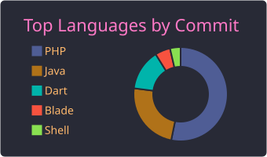
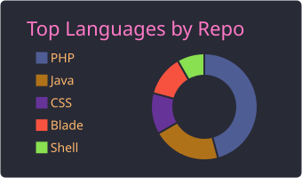

 

---

<h2> Executive Summary</h2>

Senior Backend Engineer focused on **scalable systems, distributed architectures, and financial infrastructure**.

I deliver production systems with:

- High-throughput APIs
- Event-driven microservices
- Real-time data processing
- Performance optimization at scale

---

<h2> Core Expertise</h2>

---

<h2> Architecture Capabilities</h2>

- Microservices & service decomposition
- Event-driven architecture (queues, async workflows)
- High-performance API optimization (<100ms targets)
- Multi-tenant SaaS design
- Payment orchestration & reconciliation systems
- Real-time systems using WebSockets

---

<h2> Key Systems Built</h2>

<h3> Payment Platform (FastPay)</h3>

- Multi-tenant architecture
- Stripe integration with webhook reconciliation
- Distributed transaction handling
- Real-time processing pipelines

<h3> Auction System</h3>

- Live bidding with WebSockets
- Event-driven backend
- Wallet & transaction system

<h3> ISP Platform</h3>

- MikroTik + FreeRADIUS integration
- Billing automation
- High-availability backend

---

<h2> Professional Experience</h2>

**Backend Engineer — Mzaodin (2024–2025)**
- Designed scalable APIs and real-time systems
- Built admin dashboards using the Laravel ecosystem
- Implemented async job pipelines

**Backend Engineer — Q Company (2023–2024)**
- Delivered ERP and enterprise systems
- Improved performance by 40% using Redis
- Refactored legacy systems for scalability

---

<h2> GitHub Analytics</h2>

 

---

<h2> Activity Graph</h2>

---

<h2> Contact & Opportunities</h2>

---

<h2> Open To</h2>

- Senior Backend Roles
- Distributed Systems Engineering
- FinTech / Payment Infrastructure
- High-scale SaaS Platforms

